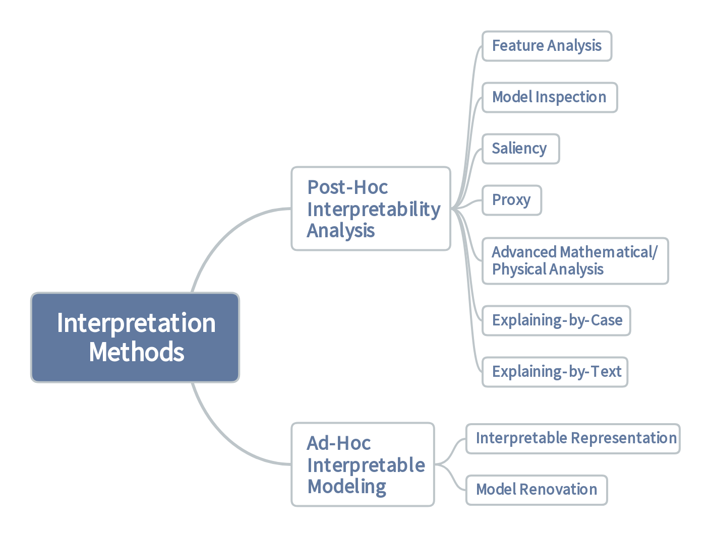

## Ⅰ INTRODUCTION

### A. What Does Interpretability Mean?

Generally speaking, interpretability refers to the extent of human‘s ability to understand and reason a model.

一般来说，可解释性是指人类理解和推理模型的能力的程度。（可解释性就是用合理的有依据的方法让人类相信你的模型是正确的）

- **Simulatability is considered as the understanding over the entire model.**

  用简单的模型去模拟复杂的神经网络（模型越简单，模型越容易解释，模型的可解释性越高）

- **Decomposability is to understand a model in terms of its components, such as neurons, layers, blocks, and so on.**

  将复杂的神经网络分解为多个模块，分析各个模块的功能和可解释性。

- **Algorithmic transparency is to understand the training process and dynamics of a model.** 

  神经网络缺乏透明度体现为：

  - 算法不可解释
  - 训练数据集缺乏可视性（数据来源、数据处理、训练模型的特征）
  - 数据选择方式不透明
  - 对训练数据集中偏见的理解有限
  - 模型版本化的透明度有限

### B. Why Is Interpretability Difficult?

**1. Human Limitation能力限制**

Expertise is often insufficient in many applications. Nowadays, deep learning has been extensively used in tackling intricate problems, which even professionals are unable to comprehend adequately.

简单来说就是有些深度学习的结果没有人能证明是怎么得来的

**2. Commercial Barrier商业壁垒**

First and foremost, companies profit from black-box models. It is not a common practice that a company makes capital out of totally transparent models. Second, model opacity helps protect hard work from being reverse engineered. An effective black box is ideal in the sense that customers being served can obtain satisfactory results while competitors are not able to steal their intellectual properties easily. Third, prototyping an interpretable model may cost too much in terms of financial, computational, and other resources. 

我不太清楚为什么要扯上商业去，他给出的解释为：

- 公司从不可解释的模型中获利，但是不会用完全透明的模式来生产资本
- 模型的不透明度有利于保护工作使得竞争对手不容易窃取到知识产权
- 构建一个可解释模型在财务、计算和其他资源方面花费太高，不值得

**3. Data Wildness数据紊乱**

- On the one hand, although it is a big data era, high-quality data are often not accessible in many domains. 

  **高度异质性**和**不一致**的数据阻碍了深度学习模型的准确性的同时而也阻碍了可解释性的构建。

- On the other hand, real-world data have the character of high dimensionality, which suppresses reasoning.

  神经网络训练模型过程中存在维度映射，深度学习模型输入变量的数量过大。

**4. Algorithmic Complexity算法复杂**

Deep learning is a kind of large scale and highly nonlinear algorithms. Convolution, pooling, nonlinear activation, shortcut, and so on contribute to the variability of neural networks. 

深度学习是一种大尺度的高度非线性算法。卷积、池化、非线性激活、快捷方式等都有助于促进神经网络的可变性。**深度学习的算法和参数的调节都会引起神经网络可解释性的改变。**

Recursiveness is another source of difficulty.

递归性是困难的另一个来源，**初始输入的微小变化可能会导致巨大的结果差异**，从而增加了解释方法的复杂性。

### C. How to Build Good Interpretation Method?

第三个主要问题是评估所提出的解释方法的质量的标准。由于现有的评价方法还不成熟，提出了五种一般的、定义良好的经验法则：

**1. Exactness精确性（准确性）**

一般来说，定量解释方法比定性解释方法更可取

|      | **定量研究**  |   **定性研究**   |
| :--: | :-----------: | :--------------: |
|  1   |   检验假设    |     提出假设     |
|  2   |  用数字表示   |    用文字表达    |
|  3   | 较大的样本量  |   较小的样本量   |
|  4   | 数学/统计分析 | 总结、分类、解释 |

如果目标是证实或检验理论或假设，很可能会选择定量方法；如果想理解或探索一个想法，应该采用定性的方法。

**2. Consistency一致性**

一致性表明，在一个解释中不存在矛盾。对于多个相似的样本，一个公平的解释应该能产生一致的答案。此外，一种解释方法应与真实模型的预测相一致。

**3. Completeness完整性**

从数学上讲，神经网络是为了学习最适合数据的映射。一个好的解释方法应该显示支持最大数据实例和数据类型的有效性。即一个解释方法应该尽可能完整地解释整个神经网络。

**4. Universality普遍性**

随着深度学习快速发展，大大丰富了深度学习的学习方法，一个好的解释方法应该尽可能多的去解释更多模型，节省劳动力和时间。

**5. Reward奖励性**

对深度学习的深入理解将有助于神经网络的研究和应用。

## Ⅱ  SURVEY ON INTERPRETATION METHODS

**A. Taxonomy Definition分类定义**

**B. Post-Hoc Interpretability Analysis事后可解释性分析**

**备注：以下部分为机翻内容，未经修改，仅供参考**

### Post-hoc interpretability

Post-hoc interpretability is conducted after a model is well learned. A main advantage of *post-hoc* methods is that one does not need to compromise interpretability with the predictive performance since prediction and interpretation are two separate processes with out mutual interference. However, a *post-hoc* interpretation is usually not completely faithful to the original model. If an interpretation is 100% accurate compared to the original model, it becomes the original model.

事后的可解释性是在对一个模型进行了充分的学习之后进行的。事后方法的一个主要优点是，不需要降低可解释性，因为预测和解释是两个独立的过程，没有相互干扰。然而，一个事后的解释通常并不完全忠实于原始的模型。如果一个解释与原始模型相比是100%准确的，那么它就成为了原始模型。

Therefore, any interpretation method in this category is more or less inaccurate. What is worse is that we often do not know the nuance. Such a nuance makes it hard for practitioners to have a full trust to an interpretation method, because the correctness of the interpretation method is not guaranteed.

因此，这类人的解释方法或多或少是不准确的。更糟糕的是，我们经常不知道其细微差别。这种细微的差别使从业者很难完全信任一种解释方法，因为解释方法的正确性不能得到保证。

#### 1. Feature analysis特征分析

特征分析技术主要集中于比较、分析和可视化神经元和神经元层的特征。通过特征分析，识别出了敏感的特征和处理它们的方法，从而在一定程度上解释了模型的基本原理。

特征分析技术可以应用于任何神经网络，并提供关于网络学习到哪些特征的定性见解。然而，这些技术缺乏深入、严格和统一的理解，因此不能用于修改模型，以获得更高的可解释性。

#### 2. Model inspection模型检验

模型检验方法利用外部算法，通过系统地提取神经网络内部工作机制的重要结构和参数信息，利用外部算法深入研究神经网络。

这类方法比特性分析中的方法在技术上更负责任，因为像统计数据等分析工具直接涉及到性能分析过程中。因此，通过模型检验方法获得的信息更可信和有益。在一个示例性的研究中，找到重要的数据路由路径被用作理解模型的一种方法。有了这样的数据路由路径，模型可以忠实地压缩成一个紧凑的模型。换句话说，可解释性提高了模型压缩的可信度。

#### 3. Saliency显著性

显著性方法识别输入数据的哪些属性与模型的预测或潜在表示最相关。在这一类中，涉及到人工检查，以决定一个显著性地图是否合理。显著性地图是有用的，也就是说，如果北极熊总是出现在带有雪或冰的图片中，该模型可能会滥用冰雪的信息来探测北极熊，而不是北极熊的真实特征。有了一个显著性映射，就可以找到这个问题，从而避免了这个问题。

显著性方法在可解释性研究中很流行，然而，广泛的随机检验报告说，一些显著性方法可能是模型独立和数据独立的[3]；也就是说，一些方法提供的显著性映射与边缘检测器产生的结果高度相似。这是有问题的，因为这意味着这些显著性方法无法找到能够解释模型预测的输入的真实属性。因此，在这些情况下，应开发一种与模型相关和与数据相关的显著性方法。

#### 4. Proxy代理

代理方法构造了一个更简单、更可解释的代理，它非常类似于一个经过训练的、大型的、复杂的和黑箱模型。代理方法可以在局部空间中是局部的，也可以在整个解空间中是全局的。示例性的代理模型包括决策树、规则系统等。代理方法的缺点是构建代理模型所需的额外成本。

大约有三种方法可以作为原型的代理：

**Direct extraction直接提取**

#### 5. Advanced mathematical/physical analysis高级数学/物理分析

高级数学/物理分析方法将神经网络置于理论数学/物理框架中，在该框架中，可以使用高级数学/物理学工具了解神经网络的机制。这类研究涵盖了深度学习的理论进展，包括非凸优化、表征能力和泛化能力。

这类研究中所关注的一个问题是，为了建立一个合理的解释，有时会做出不切实际的假设，以促进理论分析，这可能会损害解释的实际有效性。

#### 6. Explaining-by-Case案例解释

案例解释方法是基于案例推理[90]的。人们喜欢的例子。一个人可能不会被一个产品的无聊的统计数字所吸引，但在听到其他用户使用这种产品的体验时，他可能会感到惊讶。这一哲学赢得了许多从业者的心，并吸引了深度学习的基于案例的解释。按案例解释的方法提供了捕获模型本质的代表性示例。

这类方法既有趣又鼓舞人心。然而，这种做法更像是一种完整性检查，而不是一种一般的解释，因为从选定的查询用例中并没有理解到很多关于神经网络的内部工作的信息。

#### 7. Explaining-by-Text文本解释

文本解释方法在有利于理解模型行为的图像语言联合任务中生成的文本描述。这个类还可以包括生成用于解释的符号的方法。

这类方法在图像语言联合任务中特别有用，例如从x射线x线片中生成诊断报告。然而，用文本来解释并不是任何深度学习模型的通用技术，因为它只能在模型中存在语言模块时工作。

### Ad-Hoc Interpretable Modeling

临时可解释性建模消除了在事后可解释性分析中或多或少存在的偏差。虽然一般认为在可解释性和模型可表达性[123]之间存在权衡，但仍然有可能找到一个既强大又可解释的模型。一个显著的例子是在[30]中报告的工作，其中一个可解释的双层加性风险模型在FICO识别竞赛中获得了第一名。

#### 8. Interpretable representation可解释的表示

可解释表示方法采用正则化技术来引导神经网络的优化走向更可解释的表示。诸如可分解性、稀疏性和单调性等性质可以增强可解释性。因此，正则化特性成为了允许更多可解释的模型的一种方法。相应地，为了实现可解释性，损失函数必须包含一个正则化术语，这限制了原始模型执行其完整的学习任务。

#### 9. Model renovation模型改造

模型改造方法通过设计和部署更多可解释的机制来寻求可解释性。这些机制包括具有故意设计的激活功能的神经元、具有特殊功能的插入层、模块化架构等等。未来的发展方向是使用越来越多的可解释的组件，同时可以为不同的任务实现类似的最先进的性能。

