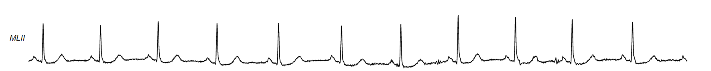
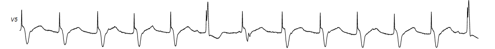
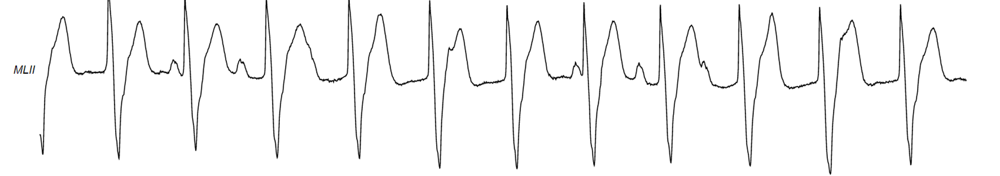
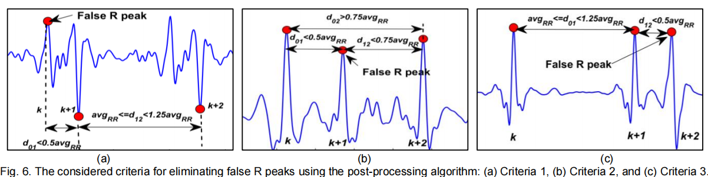
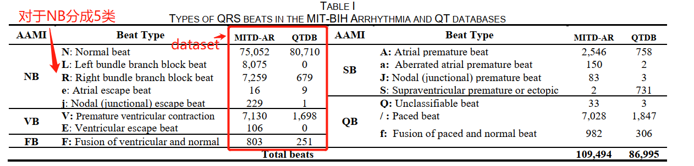
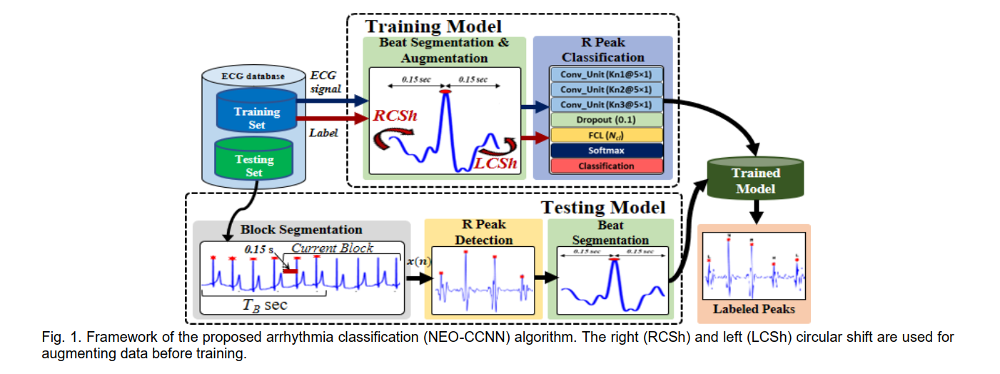
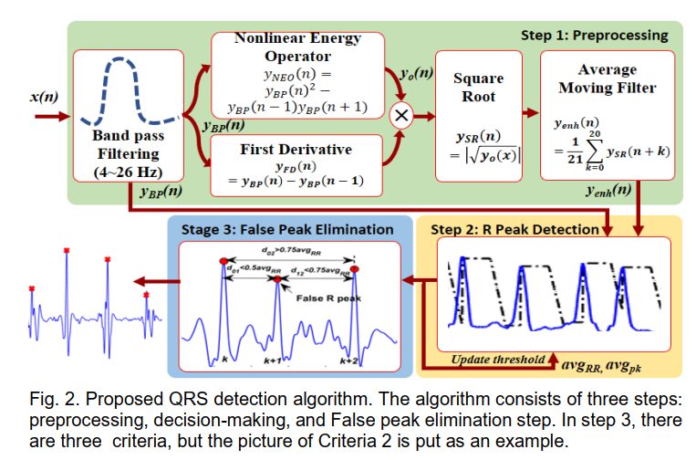
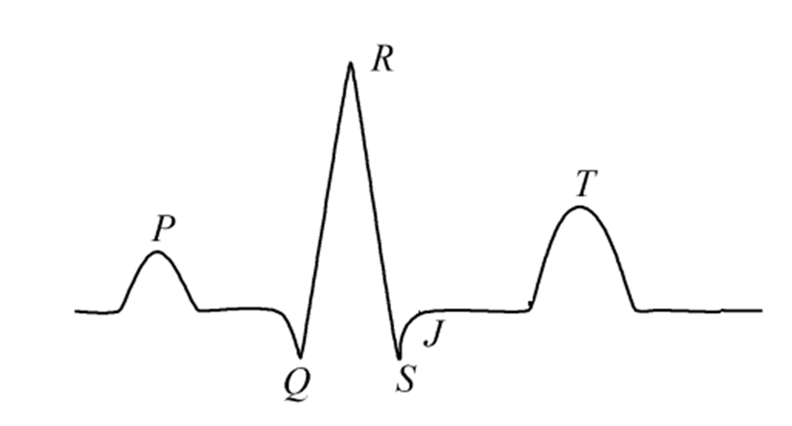
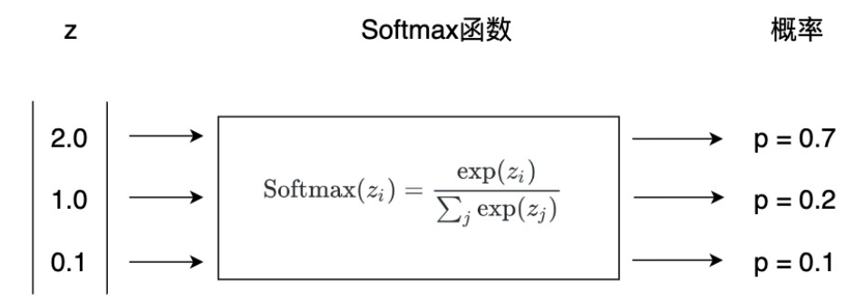

## 0. ECG Database

MIT-BIH心率失常数据库和QT数据库

-  **MIT-BIH Arrhythmia (MITD-AR)：** 47例患者（25M/22F），with the age of 23–89 years with a total of 24 hours. Each record is 30-min long and sampled at 360 Hz. 
-  **QT database (QTDB)：** consists of 105 ECG records and only 82 records are annotated. The total duration of the annotated records is 20.5 hours with 86,995 annotated beats. Each record has a duration of 15-min and is sampled at 250 Hz.

[MIT-BIH ECG 心电数据的下载和读取图解](https://blog.csdn.net/chenyusiyuan/article/details/2027887)

[MIT-BIH Arrhythmia Database v1.0.0](https://www.physionet.org/content/mitdb/1.0.0/)

[MIT-BIH心律失常数据库详解](https://blog.csdn.net/Mrm_cong/article/details/104668271)

MIT为了节省文件长度和存储空间，使用了自定义的格式，所以没有通用的读取方式。

一个心电记录由三个部分组成：

1. 头文件[.hea]，存储方式ASCII码字符。
2. 数据文件[.dat]，按二进制存储，每三个字节存储两个数，一个数12bit。
3. 注释文件[.art]，按二进制存储，格式定义比较复杂，但是只要知道第（2）个如何读入Matlab就可以类推出如何读第（3）个

### Visualize waveforms（ECG波形可视化）

[LightWAVE: .../1.0.0 (physionet.org)](https://www.physionet.org/lightwave/?db=mitdb/1.0.0)

## 摘要

本文提出了一个**健壮**的心律失常分类算法，**NEO-CCNN**，它可以被应用在单片机制造的**可穿戴**设备上。它可以**检测QRS波群**，并且在**基于时间的自适应阈值技术**的帮助下准确**定位R峰值**，从而提高心律失常分类的**准确性**和**敏感性**。

**NEO**（Nonlinear energy operator）---增强R峰

**1D-CNN**（optimized compact）---分类

**QRS 波群增强方法** --- 在训练过程中解决R峰值定位错误(RLE)

**嵌套 k1k2折 交叉验证方法**--- 评估模型的鲁棒性

结果（不赘述）

## 简介

**存在的问题**

+ 对于未经处理的ECG信号，数据传输耗电限制传感器的电池生命（MITD-AR上评估的良好分类准确率达98%，代价是使用复杂的神经网络）。
  - 所以传感器采用嵌入式心律失常分类器来构建

+ ECG形态学变化受到年龄、性别、生理状况和行为的影响——嵌入式分类器合适准确率

+ 不规律心律的发散性，导致分类更加复杂

+ 好的分类结果要使用复杂的网络结构（不适合嵌入式设备），评估结果基于特意选定的数据

+ 相比其它神经网络方法，阈值方法比较简便，但是选择合适的阈值困难很大。
+ 很少研究考虑了R峰值定位错误的情况，即R峰值标签和检测到的R峰值之间的误差

## 1. 数据处理

为了考虑一致性，MITD-AR中的样本被重新采样到250Hz（fs = 250 Hz）。根据心脏病专家的注释，两个数据集列出了两个数据集的跳动分布（表一），其中搏动类型根据AAMI进行分类，即正常非异位搏动（NB）、室上异位搏动（SB）、室异位搏动（VB）、融合搏动（FB）和未知搏动（QB）。

## 2. Methodology

图1显示了所提出的NEO-CCNN算法的框架。大致可以分为两个主要阶段:R峰检测和拍分。在R峰检测阶段，提出了一种**基于时间依赖阈值的算法，该算法将NEO与一阶导数相结合进行预处理**。将检测到的R峰以R峰为中心分割成0.3 s的段，这足以覆盖一个完整的QRS复群，作为所提出的CCNN网络的输入，用于对不同拍型进行分类。使用标注的QRS峰进行训练，检测到的QRS峰用于评估，以衡量所提算法的鲁棒性。

### R峰检测

提出的QRS检测算法包括三个步骤，即**预处理、决策和微调步骤**

#### 预处理  Preprocessing Step

ECG读取完后，原始ECG信号含有**高频噪声和基线漂移**，预处理步骤用于去除不必要的噪声，并将QRS复合物与其他峰，如尖尖的P波和T波区分开来。由于大多数QRS能量在5-22Hz的频率范围内，因此设计了一个4 ~ 26 Hz的带通FIR滤波器$h (n)$和M=51的阶数来保留QRS。将NEO技术和一阶导数分别应用于**滤波后的信号**，以区分R峰和其他P峰和T峰。 
$$
NEO(n)=v(t)^2-v(t-1)*v(t+1)\\
FD(n)=v(t)-v(t-1)\\
Y_{sqrt}(n)=\sqrt{|NEO(n)*FD(n)|}\\
Y_{enh}(n)=\frac{1}{21}  {\textstyle \sum_{k=0}^{20}}y_{sqrt}(n+k)
$$

然后再对NEO和一阶导数所得值相乘后开平方根得到每个R峰的增强信号，对增强信号取平均后得到平均增强信号，平衡QRS持续之间内的R峰值，以获得更好的阈值。

#### 判断R峰 Decision-Making Step

QRS检测的精度在很大程度上取决于阈值策略。固定阈值通常由于生理条件和活动引起的心电形态变化而导致性能不佳。此外，很难从小的R峰中分辨出尖的P波和T波。针对这一问题，提出了一种时变阈值方法，如算法所示，根据检测到的R峰的R区间和振幅动态设置阈值$Th(n)$。根据提出的阈值，首先从增强信号$y_{enh}(n)$通过识别潜在的R峰位置来确定R峰,然后在其附近滤波信号$y_{BP}(n)$中寻找极大值。

扫描一个$T_B$秒的增强信号块来找到第一个比初始阈值$Th_0$大的峰值，$Th_0$根据增强信号$y_{enh}(n)$的均值和标准差设置。为了避免受到极大值或者极小值的影响，一个增强信号块被均分成4个子段，每个字段的最大值的平均值$avg_{enh-max}$用于设置$Th(n)$如
$$
\begin{equation}
    \begin{aligned}
        Th(n)=&h_{max_{i}}=\left\{\begin{matrix}
        y_{enh}(i), & if\;y_{enh}(i)\le avg_{enh-max}   \\
        avg_{enh-max}, & Otherwise
        \end{matrix}\right.\\

        &,where \; avg_{enh-max}=\frac{1}{4}  {\textstyle \sum_{S=1}^{4}} max(y_{enh}^{S} (n))
    \end{aligned}
\end{equation}
$$

把$Th(n)$固定在$h_{max_i}$会导致错误的检测T波和错过低水平的潜在R峰，为了避免这些问题，只在$M_0$样本时固定，后续$Th(n)$的值线性地衰减到在$M_1$样本里的一个参考值$th_{ref_i}$如图4，$M_o$和$M_i$的值取决于检测到的峰值的RR间隔,$th_{ref_i}$的值根据检测到的电位R峰的平均幅值($avg_{enh-Pk}$)计算，$y_{enh}(n)$的电流值为:

$\alpha$和$\eta$的值根据经验通常被设定为0.5和0.12。

如果在$M_0$样品的持续时间内发现另一个峰，则记录最高的峰作为潜在的R峰，其余的将被丢弃。用$y_{enh}(n)$中检测到的R峰作为指标，在$y_{BP}(n)$寻找实际的R峰。

解析一下算法1

#### 剔除预测错误的R峰 Elimination of False R Peaks Step 微调

现有的后处理算法（如检索算法）： 

- 依赖最后8个RR间隔进行检测遗漏的R峰
- 只考虑两个连续的峰来决定假峰和遗漏峰

新算法：

- 基于之前数据块中所有检测到的R峰值的平均振幅（𝑎𝑣𝑔𝑃𝑘）和平均RR间隔（𝑎𝑣𝑔𝑅𝑅）
- 考虑了三个连续的峰来消除假峰

 相比其他算法，考虑前面的3个连续峰值，并基于振幅均值和前面块中检测到的所有R峰的平均间隔，该算法设定了一系列的判断条件：

### R峰分类

对于心跳分类，以检测到的R峰为中心的一段持续时间为0.3 s的心电图直接传递到网络。一些拍子类型的模式之间的相似性增加了拍子分类的难度。为了解决这个问题，将当前节拍的$RR_{i,i-1}$间隔作为与节拍数据一起的特征传递给分类网络。结果，76个样本被用作心跳分类的特征。

图8a：用于节拍分类的1D-CCNN网络的框图。

**1D-CCNN：**由3个具有不同核数的卷积单元($ Kn1 $、 $Kn2$ 和 $Kn3$ )、1个具有$N_{cl}$隐藏单元的全连接层(FCL)、softmax和一个分类层组成。

- **卷积单元**用于提取局部特征图，由一个核大小为5×1的1D卷积层、整流线性激活(ReLu)和maxpool层

- **FCL层**用于分析提取出来的特征图，并将前一层的输出大小转换为要分类的事件数量。softmax层计算每个目标类在所有可能的目标类上的概率。最后，分类输出层估计代价函数来检测目标输出。

在k-fold交叉验证中，根据同一测试集的平均k-fold性能选择最佳超参数设置。这可能会导致显著的偏差，模型性能将不再是无偏的[26]。最近，在[27]中开发了一个嵌套的**k1k2-fold交叉验证**，用于通过在训练、评估和测试之间旋转数据来评估模型的性能，**如图8b**所示。因此，**采用嵌套交叉验证来衡量模型的泛化能力**。首先，通过k1次迭代(即外循环)将数据集划分为k1个分区，其中(k1-1)个分区作为训练集(DS1)，一个分区通过每次迭代的旋转方式作为测试集(DS2)。类数据的不平衡使模型倾向于人口多的类。因此，在训练前，我们使用重采样技术[28]来平衡DS1中的类数据。在每个外循环中，DS1被重采样并经过10次交叉验证(即k2=10，内循环);其中，在每个内环中，DS1的90%用于训练模型，DS1的10%用于验证模型，DS2用于测试网络。将k1×k2次折叠的平均结果作为最终值。

在实际应用中，系统应该首先检测QRS复合体，然后再对其进行分类。在以前的大多数工作中，作者只关注分类任务，所以他们使用原始的带注释的QRS数据来评估他们的分类算法。忽略检测算法的RLE误差会影响分类器的性能。因此，我们使用带注释的QRS数据(DS1)来训练我们的模型，并使用算法检测到的DS2的QRS复合体来评估它，这接近于实际应用。经过训练的模型期望以R峰为中心的段，但由于RLE的存在，检测到的R峰位置可能与实际的R位置(标注的位置)有一定距离。因此，对DS1采用基于圆移位的数据增强方法，训练模型即使移位也能对QRS进行正确分类，减少了RLE误差的影响。在扩增过程中，DS1的每个QRS拍在原有的基础上扩增为10个片段。如图1红色箭头所示，将原QRS拍5次× 1样本向右移动，将原QRS拍5次× 1样本向左移动，得到10个片段。采用**交叉熵作为损失函数**，采用**自适应矩估计(ADAM)训练算法进行反向传播**，最大课时数为100。用于ADAM算法的主要超参数是:学习率为0.001，每10个epoch后，学习率为75%，小批大小为512。

上面这段话怪怪的，意思可能是原方法直接用数据库里已经得出的结果去评估他们的分类模型，但是MIT检测算法的R峰检测存在错误预测的值，但是他们只关心节拍分类没有去剔除错误值。新提出的算法先进行R峰的检测，然后剔除错误预测的R峰，用处理后的结果去进行训练模型，能够减少误差的影响

### 节拍分类

检测到的R峰被分割成以R峰为中心的0.3 s段，这足以覆盖一个完整的QRS复合体，作为所提出的CCNN网络的输入，以分类为不同的节拍类型

### 训练和检验

使用注释的QRS峰进行训练，而检测到的QRS峰用于评估，以衡量该算法的鲁棒性

## 复杂性分析和硬件实现

所提出的QRS检测算法的实现框图如图9a**（算法复杂度）**所示。硬件资源汇总见表二，并与现有方法进行比较。实现分类器的成本取决于输入数据的大小和形状、层数、内核大小和每个卷积(Conv)层的内核数量。为了找到最优解决方案，我们通过**改变所提出结构的三个Conv层中的核数量**来构建170个模型，并使用**总体精度(Overall_Acc)、精度(Acc)、灵敏度(SN)、特异性(Spec)、精度(Prec)和f1得分**[30]来评估每个模型。图9b显示了不同模型的复杂性对性能的影响。结果表明，当三个Conv层的核数分别设置为16、32和128个核时，得到的SN(98.2%)、F1- score(97.05%)和Prec(96%)的最佳结果为59141个参数。为了在性能和复杂性之间进行权衡，选择了配置为8、16和32个内核的模型。优化后的模型只有9701个参数，SN为97.68%，F1-score为95.98%，Prec为94.52%。

## Evaluation Results

我们考虑了**灵敏度(SN)、检出率(DR)、阳性预测值(𝑃+)和检测错误率(𝐸𝑅)**[3,31]等不同指标来**评估**本文提出的QRS波检测算法。此外，还使用了**r峰位置误差($RLE_{RMSE}$)的均方根(RMS)和心率变异性的标准差误差**($𝐸_{𝐻𝑅𝑉−𝑆𝐷}𝑠𝑒𝑐$)指标[3]，分别由(10)和(11)定义。

### 提出的QRS检测算法的性能

提出的QRS波检测算法的性能取决于**分割窗口大小**($T_B$)。为了确定TB的最佳值，我们在检测SN时将其从5 s改变到40 s。我们发现15s的$T_B$在缓冲区大小和性能之间做出了很好的权衡。表IV列出了使用本文提出的检测算法对MITD-AR的48条记录所获得的结果。据观察，记录105的FPs最高，因为它包含了高分贝的噪音和QRS波等伪影。116和203号记录中部分R峰的低振幅和多形室性早搏复合征(pvc)的大量导致FNs最高。21条记录的SN达到100%，29条记录的P+达到100%。仅105、108、203 3条记录DR < 99%。与给定的MITD-AR注释相比，本文提出的检测算法平均RLERMS为7.94 ms，平均EHRV-SD为18.55 ms。我们注意到，记录116中一些极低振幅的R峰使得检测它们具有挑战性，并导致SDNNDP和SDNNAP之间的高RMS误差。

与其他方法相比，表V显示了本文算法得到的结果。MITD-AR:很明显，我们的简单检测算法接近[31]中复杂深度网络方法的性能。此外，**我们的检测算法的性能也优于其他方法**。SN、P+、DR、ER值较[32]分别提高了0.341%、0.422%、0.76、78.75%，较[33]最佳值分别提高了0.05%、0%、0.046%、18.4%。与Tompkins[16]相比，我们的SN、P+、DR、ER、RLERMS和EHRV-SD分别提高了0.77%、0.29%、1.11%、84.3%、21.46%和93.38%。在RLE和HRV误差方面，与[3,16]相比，本文方法的值最小。

QT数据库:观察到我们的算法接近[3]的性能，而它有最小的$RLE_{RMS}$和ER。且在SN、P+、DR、ER方面优于其他方法。例如，SN、P+、DR和ER分别比[34]提高0.05%、0.2%、0.24%和87.86%。如图10所示，由于QTDB中R峰的注释不准确，因此得到的QTDB的RLE相对于MITD-AR中得到的RLE高。**结果表明，与现有方法相比，本文方法可以有效地检测不同临床心电图信号的R峰，且RLE和HRV误差最小。**基于我们的Matlab实现，提出的检测算法需要0.22 s，而Tompkins算法[16]需要0.27 s来检测30分钟记录的QRS波群，采样频率为250 Hz。这意味着我们的预样本执行时间仅为0.49 μs，而汤普金斯算法为0.6 μs，这使得我们的算法适用于实时应用和可穿戴ECG设备。

### NEO-CCNN分类算法的性能研究

为了研究QRS波检测算法对分类准确率的影响，我们将检测到的QRS波数据与标注的QRS波数据进行了分类模型的测试。由于k1设为2，因此将50%的标注数据作为DS1进行训练，DS2考虑三种情况进行测试，即1)DS2为剩余50%的标注QRS数据，2)DS2为剩余50%的标注QRS数据使用我们的检测算法检测，3)DS2为剩余50%的标注QRS数据使用Tompkins算法[16]检测。表VI显示了将MITD-AR数据库的ECG心跳分为5类(N、L、R、A、V)的3个案例的结果。可以观察到，与受到检测算法RLE误差影响的案例2和案例3相比，注释QRS数据(案例1)取得了最好的结果。由于QRS波检测算法的RLE误差较小，分类结果在总体Acc、平均Acc、SN、Spec、F1-score和Prec方面分别提高了1.52%、0.59%、4.43%、0.66%、3.68%和3%。

为了提高训练成绩和避免RLE的影响，训练前DS1的QRS波通过左右圆移的方式进行增强。从表VI可以看出，训练数据的增加使得模型能够适应RLE误差。与病例2和3相比，这降低了RLE的影响，从而允许使用注释QRS的性能方法(病例1)。考虑使用我们的QRS检测数据进行数据增强(即病例2 + Aug)， Overall_Acc、Acc、SN、Spec、F1-score和Prec的性能分别提高了1.82%、0.72%、2.30%、0.62%、4.49%和5.61%。我们的算法应用增广前后的混淆矩阵如表VI所示。

为了比较本文提出的分类算法与其他算法的鲁棒性，我们考虑了不同的分类任务(见表VII)，将MITD-AR数据库的ECG搏动分类为以下类别:1)5类(即N、L、R、A和V);2) 5类(N、L、R、F、V);3) 5-AAMI分类(NB、SB、VB、FB、QB);4) 2类(即SVEB+ {NB, SB}和VEB+ {VB, FB});(5) 14个班(N、A、V、Q、/、f、f、j、L、A、j、R、E、E)，其中S班因为只有两拍不够训练而被排除。注意，提出的算法是稳健的，因为它的性能是基于MITD-AR数据库的所有48条记录，与排除了质量较差的记录的其他算法相比。此外，本文算法的性能与复杂结构网络相似或略低于复杂结构网络[8-10]。检测和分类一个QRS拍需要2.28 ms。

## Conclusion

本文提出了一种适用于便携式嵌入式系统和可穿戴设备的鲁棒QRS波检测和心律失常分类算法，即**NEO-CCNN算法**。结合**自适应时变阈值和非线性能量算子技术**，提高了算法的**鲁棒性**，提高了**检测率**和最小的Rpeak定位**误差(RLE)**。此外，为了减少RLE对分类性能的影响，基于数据增强构建了一个**紧凑的一维ccnn网络**。在MIT-BIH心律失常和QT数据库中，我们引入了一种嵌套的**k1k2折叠交叉验证方法**来评估我们的算法的**性能**。仿真结果表明，本文提出的算法在**简单、高效和鲁棒性**方面可以与其他算法相媲美，甚至在某些情况下优于其他算法。对于MIT-BIH数据库，它能够检测99.79%以上的R峰，RLE为7.94 ms。使用仅包含9 701个参数的优化CCNN模型将检测到的R峰分为5类，**准确度**为99.43%，**灵敏度**为97.68%。我们使用带有i5处理器的笔记本电脑和STM32F407微控制器实现NEO-CCNN算法，检测和分类30分钟记录的R拍时间分别为6.44 s和46.61 s。这使得我们的算法适用于可穿戴ECG设备对心脏疾病进行分类。未来的工作应继续寻找解决可用数据集不平衡的问题，从而影响训练模型的泛化能力。此外，我们还将利用本文的成果开发一种可穿戴式心电图设备，用于心律失常的分类。

## 图表解释

对于搏动分割和增强部分，检测到的R峰被分割成以R峰为中心的0.3 s段，这足以覆盖一个完整的QRS复合体，作为所提出的CCNN网络的输入，以分类为不同的节拍类型；

对于R峰值分类部分，结合NEO和一阶导数的基于时间阈值依赖算法用来进行预处理； 使用注释的QRS峰进行训练，而检测到的QRS峰用于评估，以衡量该算法的鲁棒性；

为了能够实时处理，每个ECG信号被分成每小块 $T_B$ 秒，同时为了避免不重叠分割造成的不连续问题，块分割时进行重叠，并确保上一块中后两个QRS峰值也包括在当前块的检测中；

**疑惑**：对于测试数据，没有对搏动进行增强？

## Question

- 没有数据对比无法表现出该算法在可穿戴设备应用中的优势

## What is an ECG

An electrocardiogram (also called an ECG or EKG) is a test that records the timing and strength of the electrical signals that make the heart beat. By looking at an ECG, a doctor can gain insights about your heart rhythm and look for irregularities.

ECG（Electrocardiogram），（又称EKG，an abbreviation from the German “Elektro-kardiographie”）是一个实验（test）,用于**记录引发心跳的电信号序列的时间节点和强度**。通过分析ECG图像，医生可以更好地诊断我们的心率是否正常，心脏功能是否存在问题。

**ECG记录的是引发心脏跳动的电脉冲序列**，由心跳活动产生的电活动变化转换成的图像。肌肉收缩过程中，电流产生在前，肌肉运动在后。心脏的收缩与之同理，心肌内产生电流后，心肌机械性收缩。

### ECG的测量

**①** **利用血液对光的吸收**

**利用绿色LED灯：**

我们的血液之所以是红色，是因为它反射红光而吸收绿光。而心脏跳动时，相比心跳间隔期间，体内流动的血液量增加，对绿光的吸收率就更高。于是我们可以通过闪烁绿灯来监测血液在某个部位的实时流量，以此来判断单位时间内的心跳数，即心率。

例如，Apple Watch就使用绿色LED灯来测量你在锻炼和呼吸时的心率，并计算步行平均速度和心率变化率(HRV)。

**利用红外线（infrared LED）：**

当Apple Watch在后台测量你的心率，和进行心率通知时，使用的就是这种模式。

**② 利用电位差 ——** 通过在皮肤上放置多个电极来捕捉心脏部位的电脉冲

Apple Watch的ECG功能也用到这种测量方法，用户只需打开心率测量APP，将手指放在数字表冠（digital crown）上，用户就可以获得，**相比采用光感应器获取，更快更高保真的ECG数据**）。APP通过分析这些脉冲就可以得知用户的心率是否正常。

### ECG诊断基础

- **ST段：**ST段异常抬高多见于急性心肌梗死、急性心包炎等；若异常压低，多见于慢性冠心病、心内膜下心肌梗死、急性心肌炎、心室肥大、心房肥大等。
- **Q-T间期：**Q-T间期延长见于心肌梗死、冠状动脉供血不足、低钾血症、低钙血症、药物的影响，也可见于遗传性原发性Q-T间期延长。
- **P-R间期：**中老年患者P-R间期延长常见于房室传导阻滞。
- **T波：**如果T波明显增高，可能是心肌梗死早期或者是高钾血症。T波低平或倒置可见于冠心病心肌缺血、高血压、围绝经期综合征（女性更年期）电解质紊乱、心肌炎、心肌病、神经功能异常、药物影响等。
- **U波：**U波倒置见于高血压、心肌缺血、左室负荷过重或电解质改变等。U波明显增高见于血钾过低。

## What is a NEO

对神经信号进行锋电位提取时，一种方法是直接对采集信号设置阈值，提取波形；另一种方法是对信号的能量分布曲线设置阈值。
常用的能量计算有两种，线性能量（Linear energy）和非线性能量(Nonlinear energy)。
线性能量相当于直接对数据点求平方，相当于即时功率。
而非线性能量是指，幅度平方与频率平方的乘积，即(Amplitude^2) * (Frequency^2)，由于频率的引入，这种能量计算方法可以放大突变信号（频率较高）的能量，在锋电位提取中可能会获得更好的效果。非线性能量的计算一般简化为： 
$$
NEO(n)=v(t)^2-v(t-1)*v(t+1)\\
$$
$v(t)$表示 $t$ 时刻的信号幅度，NEO 即非线性能量运算符（非线性能量算子）Nonlinear energy operator.

## PhysioNet简介（复杂生理信号研究资源）

PhysioNet英文全称为Research Resource for Complex Physiologic Signals，直译为复杂生理信号研究资源，网站为[https://physionet.org/](https://link.zhihu.com/?target=https%3A//physionet.org/)。由NIH资助，现在由MIT的计算生理学实验室管理。

医疗大数据领域广泛使用的MIMIC-III临床数据集即来自PhysioNet。包括MIMIC-III内，其管理的医疗数据库主要包括三类：一是临床数据库（Clinical Databases）；二是波形数据库（Waveform Databases）;三是图像数据库（Image Databases）。这些数据库在通过伦理考核之后，大部分可以免费访问。

**1. 临床数据库**

临床数据库除了MIMIC-III外，还有eICU Collaborative Research Database, Paediatric Intersive Care Database以及过去的MIMIC数据。和MIMIC不同，eICU是一个多中心的ICU数据集，数据采集自飞利浦eICU系统。包含超过200000次入院病例，数据内容包括生理体征测量、护理计划文档、疾病严重程度评估、诊断信息和治疗信息。

**2. 波形数据库**

波形数据库由七部分组成，包括多参数数据库（Mutli-Parameter Databases）、ECG数据集、心博间隔数据集（Interbeat (RR) Interval Databases）、其它心血管数据库、步态和平衡数据库（Gait and Balance Databases）、神经电和肌电数据库（Neuroelectric and Myoelectric Databases）、综合数据库（Synthetic Databases）。多参数数据库就包括了十多个数据集，主要是体征检测数据，有ECG、血压、呼吸等。

**3. 图像数据库**

图像数据库包括MIMIC-CXR Database和Samples of MR Images两个数据集，前一个数据集主要是胸部X光片，包含了227835次影像学检查获得的377110张图像（总大小4.6T），关于该数据集的详细描述最近在Scientific Data上发表。后一个数据集是磁共振血管造影图像，这个数据集发布于2001年，数据量也只有70M。

## Softmax函数

对于二分类问题，我们可以使用Sigmod函数（又称Logistic函数）。将$(-\infty,+\infty)$范围内的数值映射成为一个$(0,1)$区间的数值，一个$(0,1)$区间的数值恰好可以用来表示概率。
$$
Sigmod=\frac{1}{1+e^{-z} }
$$
比如，在互联网广告和推荐系统中，曾广泛使用Sigmod函数来预测某项内容是否有可能被点击。Sigmoid函数输出值越大，说明这项内容被用户点击的可能性越大，越应该将该内容放置到更加醒目的位置。

除了二分类，现实世界往往有其他类型的问题。比如我们想识别手写的阿拉伯数字0-9，这就是一个**多分类**问题，需要从10个数字中选择一个概率最高的作为预测结果。

对于多分类问题，一种常用的方法是Softmax函数，它可以预测每个类别的概率。对于阿拉伯数字预测问题，选择预测值最高的类别作为结果即可。Softmax的公式如下，其中$z$是一个向量，$z_i$和$z_j$是其中的一个元素。
$$
Softmax(z_i)=\frac{exp(z_i)}{{\textstyle \sum_{j}}exp(z_j} 
$$
下图中，我们看到，Softmax将一个$[2.0,1.0,0.1]$的向量转化为了$[0.7,0.2,0.1]$，而且各项之和为1。

Softmax函数可以将上一层的原始数据进行归一化，转化为一个$(0,1)$之间的数值，这些数值可以被当做概率分布，用来作为多分类的目标预测值。Softmax函数一般作为神经网络的最后一层，接受来自上一层网络的输入值，然后将其转化为概率。

实际上，Sigmod函数是Softmax函数的一个特例，Sigmod函数只能用于预测值为0或1的二元分类。

## 理解dropout

[CNN 入门讲解：什么是dropout? - 知乎 (zhihu.com)](https://zhuanlan.zhihu.com/p/77609689)

[(13条消息) 理解dropout_张雨石的博客-CSDN博客_dropout](https://blog.csdn.net/stdcoutzyx/article/details/49022443)
